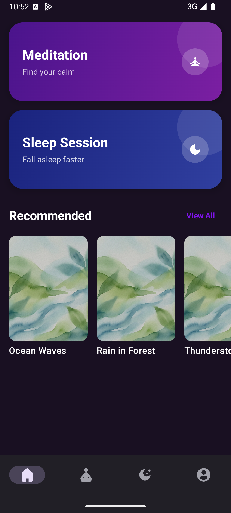
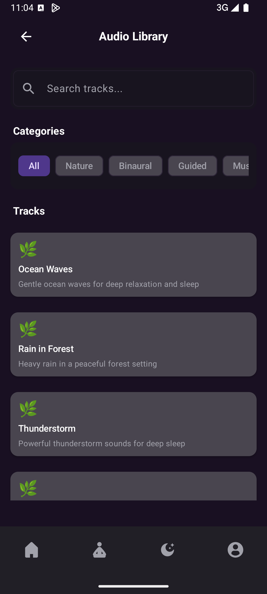
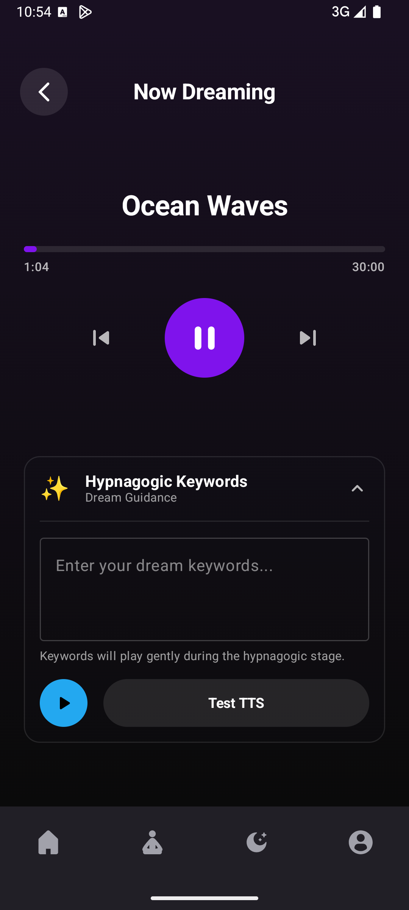
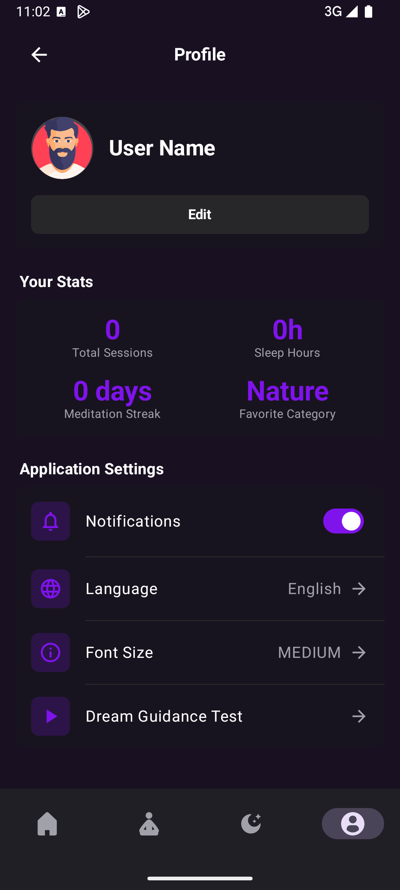

#  dreaMaze

> **A modern sleep and meditation app designed to help you find peace and improve your sleep quality**

[](https://developer.android.com/)
[](https://kotlinlang.org/)
[](https://developer.android.com/jetpack/compose)

## Overview

dreaMaze is a beautifully designed Android application that combines sleep therapy and meditation features to create a comprehensive wellness experience. Built with modern Android development practices, it offers a seamless user experience with multilingual support and intuitive navigation.

## Features

### Audio Library
- **Curated Audio Collection**: High-quality nature sounds, binaural beats, and meditation music
- **Timed Sessions**: 30 minutes, 1 hour, or 3 hours duration options
- **Smart Categorization**: Organized by sleep, meditation, and relaxation categories
- **Favorites System**: Save and organize your preferred tracks

### 😴 Sleep Sessions
- **Dream Guidance**: The vocalization of hypnagonic words during the deep sleep phase to guide dreams without activating consciousness during dreams.
- **Improve Sleep Quality**: Specially selected sounds for improved sleep quality

### 🧘 Meditation Sessions
- **Guided Meditation**: Binaural beats and meditation music
- **Progress Tracking**: Monitor your meditation journey

### 🌍 Multilingual Support
- **Turkish & English**: Full localization support
- **TTS Integration**: Text-to-speech in selected language

### 📊 User Analytics
- **Session Statistics**: Track your sleep and meditation habits
- **Progress Monitoring**: View your wellness journey
- **Streak Tracking**: Maintain consistent practice
- **Personalized Insights**: Understand your patterns

## Technical Stack

### Core Technologies
- **Kotlin**
- **Jetpack Compose**
- **Material Design 3**
- **Hilt**

### Architecture
- **MVVM Pattern**
- **Repository Pattern**
- **Flow & StateFlow**
- **Room Database**

### Key Libraries
- **ExoPlayer**
- **DataStore**
- **Navigation Compose**
- **Coroutines**

## Getting Started

### Prerequisites
- Android Studio Arctic Fox or later
- Android SDK 24+ (Android 7.0)
- Kotlin 1.8.0+
- Gradle 8.0+

### Installation

1. **Clone the repository**
   ```bash
   git clone https://github.com/GorkemPalali/dreaMaze.git
   cd dreaMaze
   ```

2. **Open in Android Studio**
   - Launch Android Studio
   - Select "Open an existing project"
   - Navigate to the cloned directory

3. **Sync Project**
   - Android Studio will automatically sync Gradle files
   - Wait for the sync to complete

4. **Run the App**
   - Connect an Android device or start an emulator
   - Click the "Run" button or press `Shift + F10`

### Build Configuration

The app uses the following build variants:
- **Debug**: Development build with logging enabled
- **Release**: Production build with optimizations

## Screenshots

<div align="center">

### Home Screen

*Discover meditation and sleep sessions with personalized recommendations*

### Audio Library

*Browse curated audio tracks organized by categories*

### Session Screen

*Active playback with dream guidance and hypnagogic keywords*

### Profile

*Track your progress, manage settings, and view statistics*

</div>

## Usage

### Getting Started
1. **Launch the app** and explore the home screen
2. **Choose your session type**: Sleep or Meditation
3. **Select duration**: 30 minutes, 1 hour, or 3 hours
4. **Start your journey** towards better sleep and mindfulness


## Localization

dreaMaze supports multiple languages with live switching:

- **English**: Default language
- **Turkish**: Full Turkish localization

## Configuration

### Audio Files
Place your audio files in `app/src/main/res/raw/` directory. Supported formats:
- MP3
- WAV
- OGG

### Database
The app uses Room database for local storage. Database schema is automatically managed with migrations.

## Testing

The project includes comprehensive testing:

```bash
# Run unit tests
./gradlew test

# Run instrumented tests
./gradlew connectedAndroidTest

# Run all tests
./gradlew check
```

## Performance

dreaMaze is optimized for performance:
- **Efficient Audio Playback**: ExoPlayer for smooth audio streaming
- **Memory Management**: Proper lifecycle management
- **Background Processing**: Foreground services for uninterrupted playback
- **Database Optimization**: Room with efficient queries

## Author

**Görkem Palalı**
- GitHub: [@GorkemPalali](https://github.com/GorkemPalali)
- LinkedIn: [Görkem Palalı](https://www.linkedin.com/in/GorkemPalali34/)

---

<div align="center">

[⭐ Star this repo](https://github.com/GorkemPalali/dreaMaze) • [🐛 Report Bug](https://github.com/GorkemPalali/dreaMaze/issues) • [💡 Request Feature](https://github.com/GorkemPalali/dreaMaze/issues)

</div>

